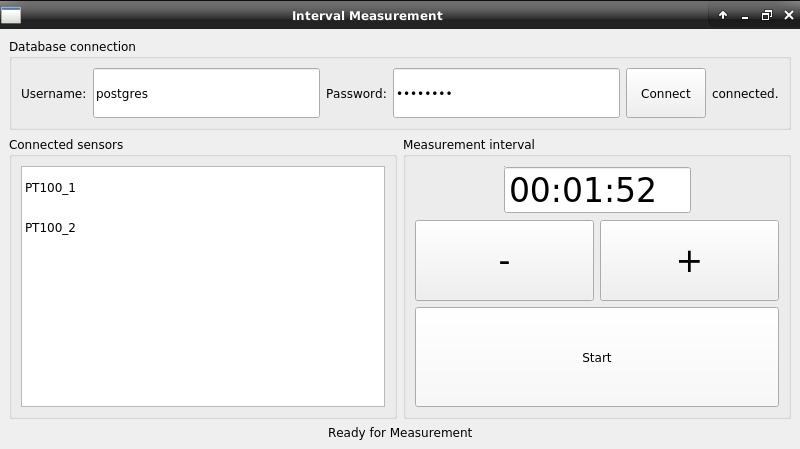
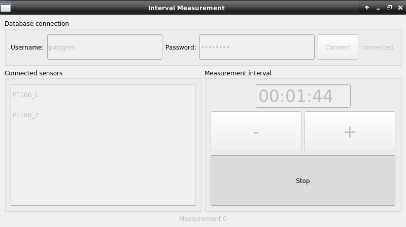

# Observer
> A small object oriented interval GUI measurement program developed for Raspberry Pi and touch screens.

## Install

Download the repository, install requirements, if desired freeze package using for example pyInstaller.

## Overview

