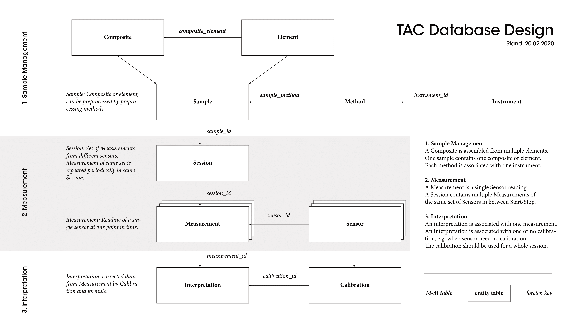

# Observer
> A small object oriented interval GUI measurement program developed for Raspberry Pi and touch screens.

## Install

Download the repository, install requirements, if desired freeze package using for example pyInstaller.

## Overview

The App allows to simply start, stop and save interval measurements using different connected sensors. The interface is designed to be very simple and easily operable on a touch screen device.

Once started, the interface elements become inactive until the measurement is stopped. Typical measurements last from days up to several weeks. For these relatively long periods the application had to be developed with robostness and self-correcting behavior in mind. Once an irreparable error occurs, the user is notified by a pop-up and via email.

Furthermore, a relational database scheme has been developed to store and access measurements remotely. This is particularly critical, as the device is usually carried around and connected to some setup for which a constant power supply is not always guaranteed.

